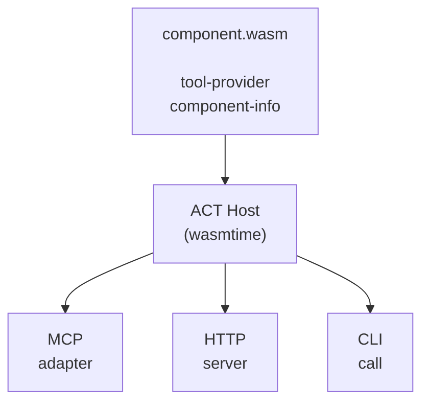

## The Big Picture

ACT separates **tool logic** from **how it's consumed**:

A component exports the `tool-provider` interface. The host loads the component and exposes its tools through one or more transport adapters.

## Core Contract

Every ACT component implements three functions from `act:core@0.2.0`:

| Function | Purpose |
|----------|---------|
| `get-metadata-schema` | Returns JSON Schema describing metadata the component accepts |
| `list-tools` | Returns tool definitions with schemas, descriptions, annotations |
| `call-tool` | Executes a tool and returns a stream of events |

Component info (name, version, description) is stored in a WASM custom section (`act:component`), encoded as CBOR. The host reads it at load time without instantiating the component.

## Key Design Decisions

### Stateless

There are no sessions. Metadata is passed per-call. This enables multi-tenancy — the same component instance can serve different users simultaneously.

### Streaming

`call-tool` always returns `stream<stream-event>`. Even simple results use a single-event stream. This makes the API consistent whether the tool returns instantly or streams data over time.

### Two-Level Errors

- **`result::err`** — early errors before streaming starts (tool not found, invalid arguments)
- **`stream-event::error`** — errors during streaming (connection lost, timeout)

### Self-Documenting

Tools carry localized descriptions, JSON Schemas, usage hints, anti-usage hints, and examples. AI agents read this metadata to understand how to use tools correctly.

### Host Validates

The host validates arguments against JSON Schema *before* calling the component. Components can trust that arguments match their declared schema.

## Metadata

Metadata is a list of key-value pairs passed to every call. It carries:

- **User config** — API keys, connection strings, preferences
- **Infrastructure context** — trace IDs, request IDs, progress tokens
- **Bridge forwarding** — `std:forward` blob for chaining remote components

The host merges operator config (from `act-host.toml`) with agent-provided metadata. Operators can lock fields so agents can't override sensitive values.

## Transport Adapters

ACT is not a transport protocol — it's a component contract. Transport adapters translate external protocols to ACT host calls:

- **MCP** — `tools/list` → `list-tools`, `tools/call` → `call-tool`
- **HTTP** — `GET /tools` → `list-tools`, `POST /call/{tool}` → `call-tool`
- **CLI** — `act call component.wasm tool-name --args '{...}'`

## Next Steps

- [Components in depth](/docs/concepts/components/)
- [Transport bindings](/docs/concepts/transports/)
