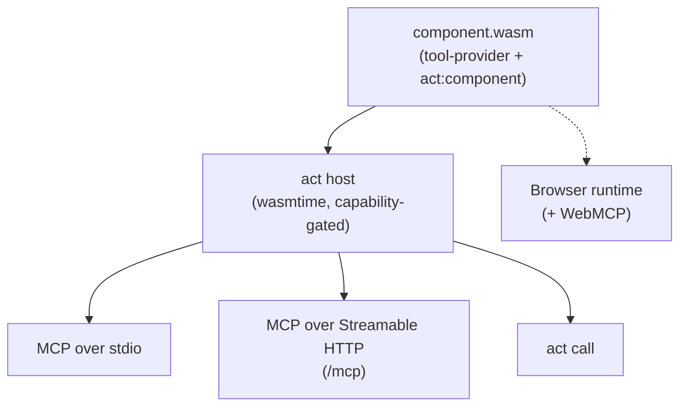

ACT — *Agent Component Tools* — is a protocol for packaging tools as WebAssembly components. One `.wasm` file works from any host: agents via MCP (stdio or HTTP), developers via the CLI, browsers via the web runtime.

## Why another protocol

Tools today are scattered across MCP servers, OpenAPI backends, ad-hoc REST APIs, and language-specific SDKs. Each target needs its own adapter, its own auth story, its own sandbox. ACT collapses the pipeline:

| Problem | ACT |
|---|---|
| One codebase per transport (MCP server, REST backend, CLI) | One `.wasm`, served over MCP (stdio or HTTP), the CLI, or in the browser |
| Tools run with full OS access | Deny-by-default filesystem + network sandbox; capabilities are declared in the component and intersected with host policy |
| Metadata drift across `Cargo.toml` / `pyproject.toml` / `package.json` | Merged at build time into a signed `act:component` custom section |
| "Works on my machine" | One `.wasm` artifact, pinned by digest and signed to the workflow that built it — the same bytes wherever it runs |

## Architecture in one picture

Every component exports the `tool-provider` interface from [`act:tools@0.2.0`](https://github.com/actcore/act-spec/blob/main/wit/act-tools/act-tools.wit). Stateful components additionally export [`act:sessions@0.2.0`](https://github.com/actcore/act-spec/blob/main/wit/act-sessions/act-sessions.wit) — used by the bridges (mcp-bridge, openapi-bridge, act-http-bridge) and any component with a session lifecycle. Both depend on [`act:core@0.4.0`](https://github.com/actcore/act-spec/blob/main/wit/act-core/act-core.wit) for cross-cutting types. The host reads each component's metadata from a WASM custom section (`act:component`, CBOR) without instantiating it, then exposes the tools over MCP — on stdio or over HTTP.

## What's in the box

- **`act`** — host CLI. Pulls components from OCI registries, HTTP URLs, or local paths; runs them as MCP server, HTTP server, or direct-call.
- **`act-build`** — component post-processor. Merges metadata from `Cargo.toml` / `pyproject.toml` / `package.json` / `act.toml` into the `.wasm`.
- **`act-sdk` (Rust)** — `#[act_component]` / `#[act_tool]` macros.
- **`act-sdk` (Python)** — `@component` / `@tool` decorators via `componentize-py`.
- **Spec** — [`actcore/act-spec`](https://github.com/actcore/act-spec). WIT is normative; JSON Schema is derived.
- **Components** — 22 published under [`actpkg.dev/library`](https://actpkg.dev), from `sqlite`
  and `postgres` to a full Python environment. See [Published components](/docs/components/).

## Next

- [Install](/docs/install/)
- [Run your first component](/docs/run-first-component/) (pull + serve + call in under a minute)
- [Build your own](/docs/build/rust/) — Rust or Python
